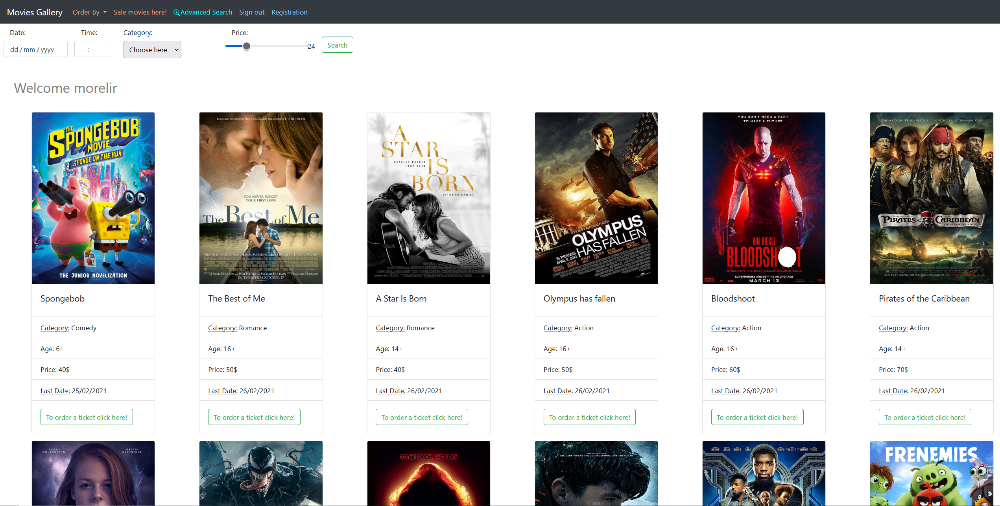
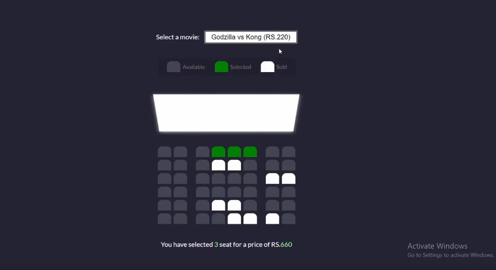
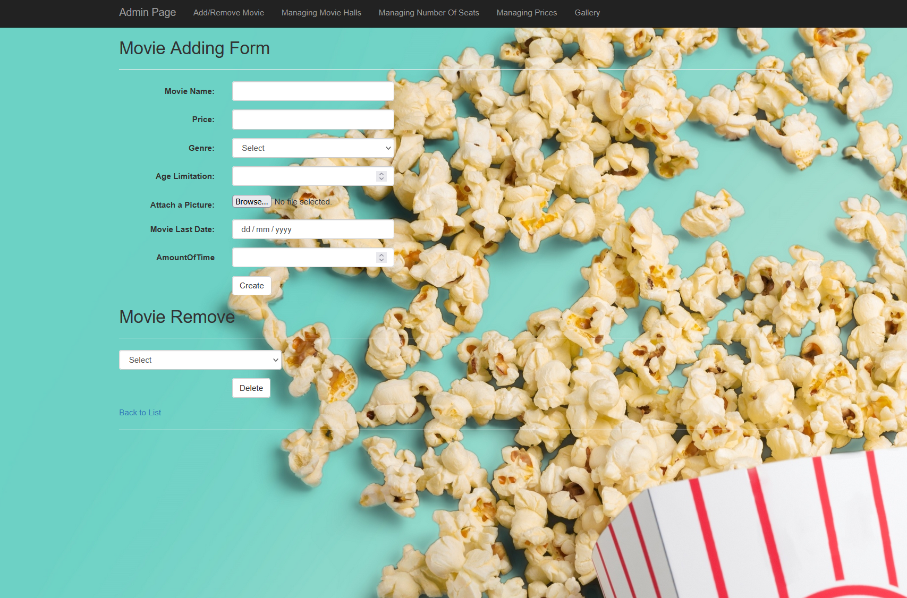
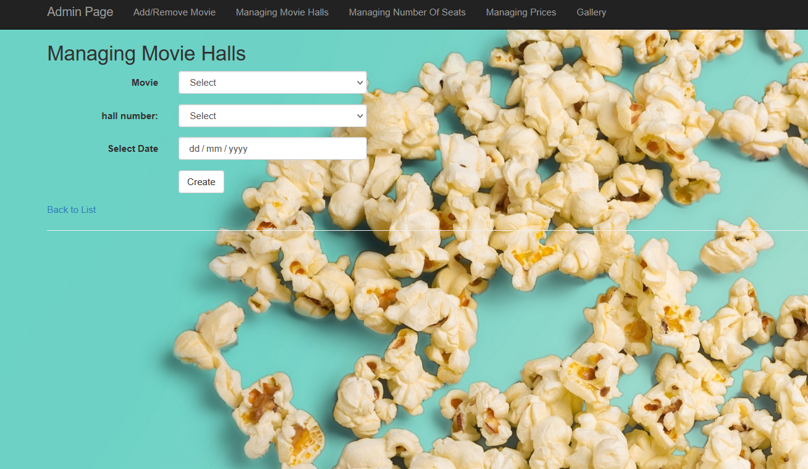

# Movie ordering system for cinemas
This project is a website for cinemas to choose a movie and a payment option.
You can register for the system and thus manage a shopping cart.
On this site you can choose movies by genre, popularity, price, and date and time.
After selecting the movie you can select available seats.
Finally, there is an option for payment in credit.

## 🛠 Skills
* ASP.NET MVC 5
* Entity Framework
* jQuery & JS
* C#
* Bootstrap

## Screenshots
* Screens for regular and admin users:

* Screens for admin users:

